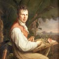
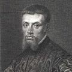
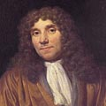
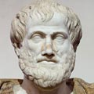

[1] <a href="https://en.wikipedia.org/wiki/Alexander_von_Humboldt">Alexander von Humboldt</a>

Birth: 14 September 1769, Berlin, Kingdom of Prussia in the Holy Roman Empire

Death: 6 May 1859 (aged 89), Berlin, Kingdom of Prussia in the German Confederation

Known for: Humboldtian science

&nbsp;

<pre>"There are three stages of scientific discovery: first people deny it is true; then 
they deny it is important; finally they credit the wrong person."    ― Alexander Von Humboldt</pre>

&nbsp;

<strong>Publications:</strong>

<ul>
<li><a href="https://github.com/manjunath5496/The-Greatest-Biologists-of-All-Time/blob/master/gbt(1).pdf">Cosmos: A Sketch of the Physical Description of the Universe, Vol. 1</a></li>
<li><a href="https://github.com/manjunath5496/The-Greatest-Biologists-of-All-Time/blob/master/gbt(2).pdf">Personal Narrative of Travels to the Equinoctial Regions of America During the Years 1799-1804</a></li>
  
<li><a href="https://github.com/manjunath5496/The-Greatest-Biologists-of-All-Time/blob/master/gbt(3).pdf">Essay on the Geography of Plants</a></li>
<li><a href="https://github.com/manjunath5496/The-Greatest-Biologists-of-All-Time/blob/master/gbt(4).pdf">Letters of Alexander von Humboldt (Written between the Years 1827 and 1858, to Varnhagen von Ense; Together with Extracts from Varnhagen's Diaries, and Letters from Varnhagen and Others to Humboldt)</a></li>
    
<li><a href="https://github.com/manjunath5496/The-Greatest-Biologists-of-All-Time/blob/master/gbt(5).pdf">Cosmos: A Sketch of the Physical Description of the Universe, Vol. 2</a></li>
<li><a href="https://github.com/manjunath5496/The-Greatest-Biologists-of-All-Time/blob/master/gbt(6).pdf">Views of Nature</a></li>
  
<li><a href="https://github.com/manjunath5496/The-Greatest-Biologists-of-All-Time/blob/master/gbt(7).pdf">The Island of Cuba</a></li>
<li><a href="https://github.com/manjunath5496/The-Greatest-Biologists-of-All-Time/blob/master/gbt(8).pdf">Personal narrative of travels to the equinoctial regions of the New continent during the years 1799-1804</a></li>
    
    
  
  
</ul>
 

[2] <a href="https://en.wikipedia.org/wiki/Andreas_Vesalius">Andreas Vesalius</a>

Birth: 31 December 1514, Brussels, Habsburg Netherlands

Death: 15 October 1564 (aged 49), Zakynthos, Venetian Ionian Islands

Known for: De humani corporis fabrica (On the Fabric of the Human Body)

&nbsp;

<pre>"I am not accustomed to saying anything with certainty after only one or two observations."    ― Andreas Vesalius</pre>

&nbsp;

<strong>Publications:</strong>

<ul>
<li><a href="https://github.com/manjunath5496/The-100-Most-Influential-Scientists-of-All-Time/blob/master/tst(237).pdf">Andreas Vesalius Bruxellensis: The Bloodletting Letter of 1539</a></li>
<li><a href="https://github.com/manjunath5496/The-100-Most-Influential-Scientists-of-All-Time/blob/master/tst(238).pdf">The illustrations from the works of Andreas Vesalius of Brussels</a></li>
<li><a href="https://github.com/manjunath5496/The-100-Most-Influential-Scientists-of-All-Time/blob/master/tst(239).pdf">Vesalius: The China Root Epistle</a></li>
</ul>
 

[3] <a href="https://en.wikipedia.org/wiki/Antoine_Lavoisier">Antoine Lavoisier</a>

Birth: 26 August 1743, Paris, France

Death: 8 May 1794 (aged 50), Paris, France

Known for: Combustion

&nbsp;

<pre>"Life is a chemical process."    ―  Antoine Lavoisier</pre>

&nbsp;

<strong>Publications:</strong>

<ul>
<li><a href="https://github.com/manjunath5496/The-Greatest-Biologists-of-All-Time/blob/master/gbt(9).pdf">Essays Physical and Chemical</a></li>
<li><a href="https://github.com/manjunath5496/The-Greatest-Biologists-of-All-Time/blob/master/gbt(10).pdf">Elements of Chemistry,
In a New Systematic Order, Containing all the Modern Discoveries</a></li>
  

    
    
  
  
</ul>

 

[4] <a href="https://en.wikipedia.org/wiki/Antonie_van_Leeuwenhoek">Antonie van Leeuwenhoek</a>

Birth: 24 October 1632, Delft, Dutch Republic

Death: 26 August 1723 (aged 90), Delft, Dutch Republic

Known for: the Microscopic discovery of microorganisms (animalcule)

&nbsp;

<pre>"In the year 1657 I discovered very small living creatures in rain water."    ―  Antonie van Leeuwenhoek</pre>

&nbsp;

<strong>Publications:</strong>

<ul>
<li><a href="https://github.com/manjunath5496/The-Greatest-Biologists-of-All-Time/blob/master/gbt(11).pdf">The Select Works of Antony Van Leeuwenhoek: Containing His Microscopical Discoveries in Many of the Works of Nature</a></li>

  

    
    
  
  
</ul>

 

[5] <a href="https://en.wikipedia.org/wiki/Aristotle">Aristotle</a>

Birth: 384 BC, Stagira, Chalcidian League

Death: 322 BC (aged approx. 62), Euboea, Macedonian Empire

Known for: Classified organisms into a "Ladder of Life"

&nbsp;

<pre>"The energy of the mind is the essence of life."    ―  Aristotle</pre>

&nbsp;

<strong>Publications:</strong>

<ul>
<li><a href="https://github.com/manjunath5496/The-Greatest-Biologists-of-All-Time/blob/master/gbt(12).pdf">History of Animals</a></li>
<li><a href="https://github.com/manjunath5496/The-Greatest-Biologists-of-All-Time/blob/master/gbt(13).pdf">Aristotle's Physics (I-II)</a></li>

<li><a href="https://github.com/manjunath5496/The-Greatest-Biologists-of-All-Time/blob/master/gbt(14).pdf">Prior Analytics</a></li>

<li><a href="https://github.com/manjunath5496/The-Greatest-Biologists-of-All-Time/blob/master/gbt(15).pdf">Posterior Analytics</a></li>

<li><a href="https://github.com/manjunath5496/The-Greatest-Biologists-of-All-Time/blob/master/gbt(16).pdf">De Anima (On the Soul)</a></li>

<li><a href="https://github.com/manjunath5496/The-Greatest-Biologists-of-All-Time/blob/master/gbt(17).pdf">Aristotle - Works</a></li>
<li><a href="https://github.com/manjunath5496/The-Greatest-Biologists-of-All-Time/blob/master/gbt(18).pdf">Metaphysics</a></li>

<li><a href="https://github.com/manjunath5496/The-Greatest-Biologists-of-All-Time/blob/master/gbt(19).pdf">Categories</a></li>

<li><a href="https://github.com/manjunath5496/The-Greatest-Biologists-of-All-Time/blob/master/gbt(20).pdf">Ethics</a></li>

<li><a href="https://github.com/manjunath5496/The-Greatest-Biologists-of-All-Time/blob/master/gbt(21).pdf">Generation of animals</a></li>
  
<li><a href="https://github.com/manjunath5496/The-Greatest-Biologists-of-All-Time/blob/master/gbt(22).pdf">On Generation and Corruption</a></li>
<li><a href="https://github.com/manjunath5496/The-Greatest-Biologists-of-All-Time/blob/master/gbt(23).pdf">Meteorology</a></li>

<li><a href="https://github.com/manjunath5496/The-Greatest-Biologists-of-All-Time/blob/master/gbt(24).pdf">Parts of Animals </a></li>

<li><a href="https://github.com/manjunath5496/The-Greatest-Biologists-of-All-Time/blob/master/gbt(25).pdf">On Sophistical Refutations. On Coming-to-be and Passing Away. On the Cosmos </a></li>

<li><a href="https://github.com/manjunath5496/The-Greatest-Biologists-of-All-Time/blob/master/gbt(26).pdf">On the Heavens</a></li>
    
  
  

  

    
    
  
  
</ul>

