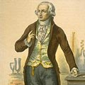

[1] <a href="https://en.wikipedia.org/wiki/Alexander_von_Humboldt">Alexander von Humboldt</a>

Birth: 14 September 1769, Berlin, Kingdom of Prussia in the Holy Roman Empire

Death: 6 May 1859 (aged 89), Berlin, Kingdom of Prussia in the German Confederation

Known for: Humboldtian science

&nbsp;

<pre>"There are three stages of scientific discovery: first people deny it is true; then 
they deny it is important; finally they credit the wrong person."    ― Alexander Von Humboldt</pre>

&nbsp;

<strong>Publications:</strong>

<ul>
<li><a href="https://github.com/manjunath5496/The-Greatest-Biologists-of-All-Time/blob/master/gbt(1).pdf">Cosmos: A Sketch of the Physical Description of the Universe, Vol. 1</a></li>
<li><a href="https://github.com/manjunath5496/The-Greatest-Biologists-of-All-Time/blob/master/gbt(2).pdf">Personal Narrative of Travels to the Equinoctial Regions of America During the Years 1799-1804</a></li>
  
<li><a href="https://github.com/manjunath5496/The-Greatest-Biologists-of-All-Time/blob/master/gbt(3).pdf">Essay on the Geography of Plants</a></li>
<li><a href="https://github.com/manjunath5496/The-Greatest-Biologists-of-All-Time/blob/master/gbt(4).pdf">Letters of Alexander von Humboldt (Written between the Years 1827 and 1858, to Varnhagen von Ense; Together with Extracts from Varnhagen's Diaries, and Letters from Varnhagen and Others to Humboldt)</a></li>
    
<li><a href="https://github.com/manjunath5496/The-Greatest-Biologists-of-All-Time/blob/master/gbt(5).pdf">Cosmos: A Sketch of the Physical Description of the Universe, Vol. 2</a></li>
<li><a href="https://github.com/manjunath5496/The-Greatest-Biologists-of-All-Time/blob/master/gbt(6).pdf">Views of Nature</a></li>
  
<li><a href="https://github.com/manjunath5496/The-Greatest-Biologists-of-All-Time/blob/master/gbt(7).pdf">The Island of Cuba</a></li>
<li><a href="https://github.com/manjunath5496/The-Greatest-Biologists-of-All-Time/blob/master/gbt(8).pdf">Personal narrative of travels to the equinoctial regions of the New continent during the years 1799-1804</a></li>
    
    
  
  
</ul>
 

[2] <a href="https://en.wikipedia.org/wiki/Andreas_Vesalius">Andreas Vesalius</a>

Birth: 31 December 1514, Brussels, Habsburg Netherlands

Death: 15 October 1564 (aged 49), Zakynthos, Venetian Ionian Islands

Known for: De humani corporis fabrica (On the Fabric of the Human Body)

&nbsp;

<pre>"I am not accustomed to saying anything with certainty after only one or two observations."    ― Andreas Vesalius</pre>

&nbsp;

<strong>Publications:</strong>

<ul>
<li><a href="https://github.com/manjunath5496/The-100-Most-Influential-Scientists-of-All-Time/blob/master/tst(237).pdf">Andreas Vesalius Bruxellensis: The Bloodletting Letter of 1539</a></li>
<li><a href="https://github.com/manjunath5496/The-100-Most-Influential-Scientists-of-All-Time/blob/master/tst(238).pdf">The illustrations from the works of Andreas Vesalius of Brussels</a></li>
<li><a href="https://github.com/manjunath5496/The-100-Most-Influential-Scientists-of-All-Time/blob/master/tst(239).pdf">Vesalius: The China Root Epistle</a></li>
</ul>
 

[3] <a href="https://en.wikipedia.org/wiki/Antoine_Lavoisier">Antoine Lavoisier</a>

Birth: 26 August 1743, Paris, France

Death: 8 May 1794 (aged 50), Paris, France

Known for: Combustion

&nbsp;

<pre>"Life is a chemical process."    ―  Antoine Lavoisier</pre>

&nbsp;

<strong>Publications:</strong>

<ul>
<li><a href="https://github.com/manjunath5496/The-Greatest-Biologists-of-All-Time/blob/master/gbt(9).pdf">Essays Physical and Chemical</a></li>
<li><a href="https://github.com/manjunath5496/The-Greatest-Biologists-of-All-Time/blob/master/gbt(10).pdf">Elements of Chemistry,
In a New Systematic Order, Containing all the Modern Discoveries</a></li>
  

    
    
  
  
</ul>

 

[4] <a href="https://en.wikipedia.org/wiki/Antonie_van_Leeuwenhoek">Antonie van Leeuwenhoek</a>

Birth: 24 October 1632, Delft, Dutch Republic

Death: 26 August 1723 (aged 90), Delft, Dutch Republic

Known for: the Microscopic discovery of microorganisms (animalcule)

&nbsp;

<pre>"In the year 1657 I discovered very small living creatures in rain water."    ―  Antonie van Leeuwenhoek</pre>

&nbsp;

<strong>Publications:</strong>

<ul>
<li><a href="https://github.com/manjunath5496/The-Greatest-Biologists-of-All-Time/blob/master/gbt(11).pdf">The Select Works of Antony Van Leeuwenhoek: Containing His Microscopical Discoveries in Many of the Works of Nature</a></li>

  

    
    
  
  
</ul>

 

[5] <a href="https://en.wikipedia.org/wiki/Aristotle">Aristotle</a>

Birth: 384 BC, Stagira, Chalcidian League

Death: 322 BC (aged approx. 62), Euboea, Macedonian Empire

Known for: Classified organisms into a "Ladder of Life"

&nbsp;

<pre>"The energy of the mind is the essence of life."    ―  Aristotle</pre>

&nbsp;

<strong>Publications:</strong>

<ul>
<li><a href="https://github.com/manjunath5496/The-Greatest-Biologists-of-All-Time/blob/master/gbt(12).pdf">History of Animals</a></li>
<li><a href="https://github.com/manjunath5496/The-Greatest-Biologists-of-All-Time/blob/master/gbt(13).pdf">Aristotle's Physics (I-II)</a></li>

<li><a href="https://github.com/manjunath5496/The-Greatest-Biologists-of-All-Time/blob/master/gbt(14).pdf">Prior Analytics</a></li>

<li><a href="https://github.com/manjunath5496/The-Greatest-Biologists-of-All-Time/blob/master/gbt(15).pdf">Posterior Analytics</a></li>

<li><a href="https://github.com/manjunath5496/The-Greatest-Biologists-of-All-Time/blob/master/gbt(16).pdf">De Anima (On the Soul)</a></li>

<li><a href="https://github.com/manjunath5496/The-Greatest-Biologists-of-All-Time/blob/master/gbt(17).pdf">Aristotle - Works</a></li>
<li><a href="https://github.com/manjunath5496/The-Greatest-Biologists-of-All-Time/blob/master/gbt(18).pdf">Metaphysics</a></li>

<li><a href="https://github.com/manjunath5496/The-Greatest-Biologists-of-All-Time/blob/master/gbt(19).pdf">Categories</a></li>

<li><a href="https://github.com/manjunath5496/The-Greatest-Biologists-of-All-Time/blob/master/gbt(20).pdf">Ethics</a></li>

<li><a href="https://github.com/manjunath5496/The-Greatest-Biologists-of-All-Time/blob/master/gbt(21).pdf">Generation of animals</a></li>
  
<li><a href="https://github.com/manjunath5496/The-Greatest-Biologists-of-All-Time/blob/master/gbt(22).pdf">On Generation and Corruption</a></li>
<li><a href="https://github.com/manjunath5496/The-Greatest-Biologists-of-All-Time/blob/master/gbt(23).pdf">Meteorology</a></li>

<li><a href="https://github.com/manjunath5496/The-Greatest-Biologists-of-All-Time/blob/master/gbt(24).pdf">Parts of Animals </a></li>

<li><a href="https://github.com/manjunath5496/The-Greatest-Biologists-of-All-Time/blob/master/gbt(25).pdf">On Sophistical Refutations. On Coming-to-be and Passing Away. On the Cosmos </a></li>

<li><a href="https://github.com/manjunath5496/The-Greatest-Biologists-of-All-Time/blob/master/gbt(26).pdf">On the Heavens</a></li>
    
  
  

  

    
    
  
  
</ul>

 

[6] <a href="https://en.wikipedia.org/wiki/Claude_Bernard">Claude Bernard</a>

Birth: 12 July 1813, Saint-Julien

Death: 10 February 1878 (aged 64), Paris

Known for: Blind experimental method for objective results

&nbsp;

<pre>"It's what we think we know that keeps us from learning."    ―  Claude Bernard</pre>

&nbsp;

<strong>Publications:</strong>

<ul>
<li><a href="https://github.com/manjunath5496/The-Greatest-Biologists-of-All-Time/blob/master/gbt(28).pdf">Illustrated manual of operative surgery and surgical anatomy (Part I)</a></li>
<li><a href="https://github.com/manjunath5496/The-Greatest-Biologists-of-All-Time/blob/master/gbt(29).pdf">Illustrated manual of operative surgery and surgical anatomy (Part II)</a></li>

<li><a href="https://github.com/manjunath5496/The-Greatest-Biologists-of-All-Time/blob/master/gbt(30).pdf">An introduction to the study of experimental medicine</a></li>

<li><a href="https://github.com/manjunath5496/The-Greatest-Biologists-of-All-Time/blob/master/gbt(31).pdf">A text book of operative surgery and surgical anatomy: Part I</a></li>

<li><a href="https://github.com/manjunath5496/The-Greatest-Biologists-of-All-Time/blob/master/gbt(32).pdf">A text book of operative surgery and surgical anatomy: Part II</a></li>

</ul>

 

[7] <a href="https://en.wikipedia.org/wiki/Charles_Darwin">Charles Darwin</a>

Birth: 12 February 1809, The Mount, Shrewsbury, Shropshire, England

Death: 19 April 1882 (aged 73), Down House, Downe, Kent, England

Known for: Theory of Evolution

&nbsp;

<pre>"A man who dares to waste one hour of time has not discovered the value of life."    ―  Charles Darwin</pre>

&nbsp;

<strong>Publications:</strong>

<ul>
<li><a href="https://github.com/manjunath5496/The-Greatest-Biologists-of-All-Time/blob/master/gbt(33).pdf">Volcanic Islands</a></li>
<li><a href="https://github.com/manjunath5496/The-Greatest-Biologists-of-All-Time/blob/master/gbt(34).rar">Insectivorous plants</a></li>

<li><a href="https://github.com/manjunath5496/The-Greatest-Biologists-of-All-Time/blob/master/gbt(35).pdf">The Power of Movement in Plants</a></li>

<li><a href="https://github.com/manjunath5496/The-Greatest-Biologists-of-All-Time/blob/master/gbt(36).pdf">The Autobiography of
Charles Darwin 1809-1882</a></li>

<li><a href="https://github.com/manjunath5496/The-Greatest-Biologists-of-All-Time/blob/master/gbt(37).pdf">The Formation of Vegetable Mould</a></li>

<li><a href="https://github.com/manjunath5496/The-Greatest-Biologists-of-All-Time/blob/master/gbt(38).pdf">Geological Observations On South America</a></li>

<li><a href="https://github.com/manjunath5496/The-Greatest-Biologists-of-All-Time/blob/master/gbt(39).pdf">The Different Forms of Flowers on Plants of the Same Species</a></li>

<li><a href="https://github.com/manjunath5496/The-Greatest-Biologists-of-All-Time/blob/master/gbt(40).pdf">The Structure and Distribution of Coral Reefs</a></li>

<li><a href="https://github.com/manjunath5496/The-Greatest-Biologists-of-All-Time/blob/master/gbt(41).pdf">The Descent of Man, and Selection in Relation to Sex</a></li>

<li><a href="https://github.com/manjunath5496/The-Greatest-Biologists-of-All-Time/blob/master/gbt(42).pdf">The Expression of the Emotions in Man and Animals</a></li>

<li><a href="https://github.com/manjunath5496/The-Greatest-Biologists-of-All-Time/blob/master/gbt(43).pdf">The Foundation of the Origin of Species</a></li>

<li><a href="https://github.com/manjunath5496/The-Greatest-Biologists-of-All-Time/blob/master/gbt(44).pdf">Life and Letters of Charles Darwin, Volume 2</a></li>

<li><a href="https://github.com/manjunath5496/The-Greatest-Biologists-of-All-Time/blob/master/gbt(45).pdf">Life and Letters of Charles Darwin, Volume 1</a></li>

<li><a href="https://github.com/manjunath5496/The-Greatest-Biologists-of-All-Time/blob/master/gbt(46).pdf">The Origin of Species: By Means of Natural Selection, or the Preservation of Favoured Races in the Struggle for Life</a></li>

<li><a href="https://github.com/manjunath5496/The-Greatest-Biologists-of-All-Time/blob/master/gbt(47).pdf">The Variation of
Animals and Plants under Domestication</a></li>

<li><a href="https://github.com/manjunath5496/The-Greatest-Biologists-of-All-Time/blob/master/gbt(48).pdf">The Voyage Of The Beetle</a></li>

 
</ul>
 

[8] <a href="https://en.wikipedia.org/wiki/Edward_Jenner">Edward Jenner</a>

Birth: 17 May 1749, Berkeley, Gloucestershire, England

Death: 26 January 1823 (aged 73), Berkeley, Gloucestershire, England

Known for: Creating the first effective vaccine for smallpox

&nbsp;

<pre>"I hope that some day the practice of producing cowpox in human beings 
will spread over the world - when that day comes, there will be no more smallpox."    ―  Edward Jenner</pre>

&nbsp;

<strong>Publications:</strong>

<ul>
<li><a href="https://github.com/manjunath5496/The-Greatest-Biologists-of-All-Time/blob/master/gbt(49).pdf">Letter from Doctor Edward Jenner, to William Dillwyn, on the effects of vaccination, in preserving from the small-pox</a></li>
<li><a href="https://github.com/manjunath5496/The-Greatest-Biologists-of-All-Time/blob/master/gbt(52).pdf">The Three Original Publications on Vaccination Against Smallpox</a></li>

<li><a href="https://github.com/manjunath5496/The-Greatest-Biologists-of-All-Time/blob/master/gbt(51).pdf">An Inquiry into the Causes and Effects of the Variolae Vaccinae</a></li>

<li><a href="https://github.com/manjunath5496/The-Greatest-Biologists-of-All-Time/blob/master/gbt(50).pdf">A Continuation of Facts and Observations Relative to the Variolæ Vaccinæ, or Cow-Pox. 1800</a></li>

</ul>

 

[9] <a href="https://en.wikipedia.org/wiki/Galen"> Claudius Galenus </a>

Birth: September 129 AD, Pergamon, Asia, Roman Empire

Death: c. 210 AD, Rome, Roman Empire

Known for: First to introduce medicinal experimentation

&nbsp;

<pre>"Employment is nature's physician and is essential to human happiness."    ―  Claudius Galenus</pre>

&nbsp;

<strong>Publications:</strong>

<ul>
<li><a href="https://github.com/manjunath5496/The-Greatest-Biologists-of-All-Time/blob/master/gbt(53).pdf">The writings of Hippocrates and Galen: Part 1</a></li>
<li><a href="https://github.com/manjunath5496/The-Greatest-Biologists-of-All-Time/blob/master/gbt(54).pdf">The writings of Hippocrates and Galen: Part 2</a></li>

<li><a href="https://github.com/manjunath5496/The-Greatest-Biologists-of-All-Time/blob/master/gbt(55).pdf">Galen On the Natural Faculties</a></li>

<li><a href="https://github.com/manjunath5496/The-Greatest-Biologists-of-All-Time/blob/master/gbt(56).pdf">Galen's On the Elements According to Hippocrates</a></li>

<li><a href="https://github.com/manjunath5496/The-Greatest-Biologists-of-All-Time/blob/master/gbt(57).pdf">Galen on anatomical procedures </a></li>

<li><a href="https://github.com/manjunath5496/The-Greatest-Biologists-of-All-Time/blob/master/gbt(58).pdf">Galen on Mental Disorders</a></li>
<li><a href="https://github.com/manjunath5496/The-Greatest-Biologists-of-All-Time/blob/master/gbt(59).pdf">Galen, Three Treatises</a></li>

</ul>

 

[10] <a href="https://en.wikipedia.org/wiki/Gregor_Mendel"> Gregor Mendel </a>

Birth: 20 July 1822, Heinzendorf bei Odrau, Silesia, Austrian Empire 

Death: 6 January 1884 (aged 61), Brünn, Moravia, Austria-Hungary

Known for: Modern Genetics

&nbsp;

<pre>"I am convinced that it will not be long before the whole world acknowledges the results of my work."    ―  Gregor Mendel</pre>

&nbsp;

<strong>Publications:</strong>

<ul>
<li><a href="https://github.com/manjunath5496/The-Greatest-Biologists-of-All-Time/blob/master/gbt(53).pdf">The writings of Hippocrates and Galen: Part 1</a></li>
<li><a href="https://github.com/manjunath5496/The-Greatest-Biologists-of-All-Time/blob/master/gbt(54).pdf">The writings of Hippocrates and Galen: Part 2</a></li>

<li><a href="https://github.com/manjunath5496/The-Greatest-Biologists-of-All-Time/blob/master/gbt(55).pdf">Galen On the Natural Faculties</a></li>

<li><a href="https://github.com/manjunath5496/The-Greatest-Biologists-of-All-Time/blob/master/gbt(56).pdf">Galen's On the Elements According to Hippocrates</a></li>

<li><a href="https://github.com/manjunath5496/The-Greatest-Biologists-of-All-Time/blob/master/gbt(57).pdf">Galen on anatomical procedures </a></li>

<li><a href="https://github.com/manjunath5496/The-Greatest-Biologists-of-All-Time/blob/master/gbt(58).pdf">Galen on Mental Disorders</a></li>
<li><a href="https://github.com/manjunath5496/The-Greatest-Biologists-of-All-Time/blob/master/gbt(59).pdf">Galen, Three Treatises</a></li>

</ul>

